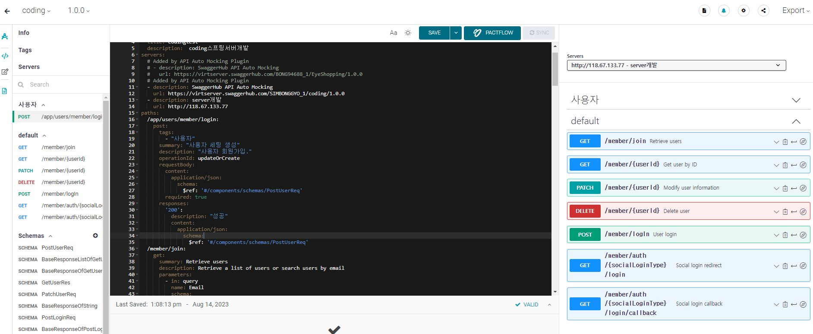
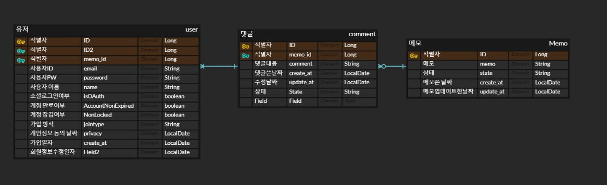

# grittestreadme
그릿테스트 readme

###
# 1. project structure
```
─main
│  ├─java
│  │  └─com
│  │      └─example
│  │          └─demo
│  │              ├─common
│  │              │  ├─config
│  │              │  ├─entity
│  │              │  ├─exceptions
│  │              │  ├─oauth
│  │              │  ├─response
│  │              │  └─secret
│  │              ├─src
│  │              │  ├─member
│  │              │  │  ├─controller
│  │              │  │  ├─dto
│  │              │  │  ├─entity
│  │              │  │  ├─repository
│  │              │  │  └─service
│  │              │  ├─test
│  │              │  │  ├─entity
│  │              │  │  └─model
│  │              │  └─user
│  │              │      ├─entity
│  │              │      └─model
│  │              └─utils
│  └─resources
└─test
    └─java
        └─com
            └─example
                └─demo
```


###
# 2. 스웨거 명세서
  ### [스웨거 명세서](https://app.swaggerhub.com/apis/SIMBONGGYO_1/coding/1.0.0)




# 3. ERD 설계서

  ### [ERD 설계서](https://www.erdcloud.com/p/mzTwMazZNm7wTf8ht)




